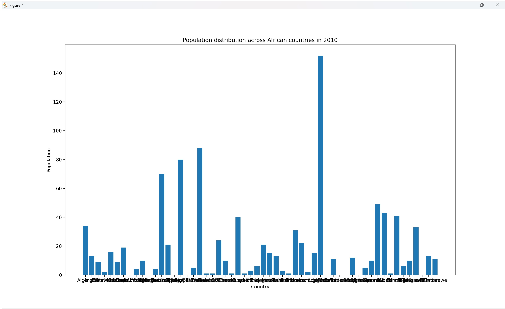
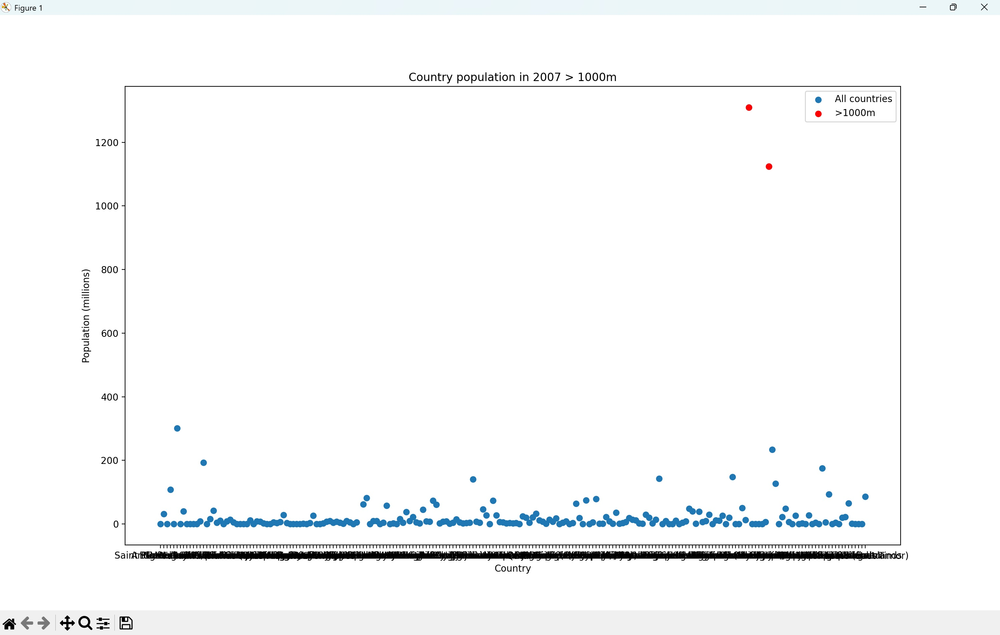
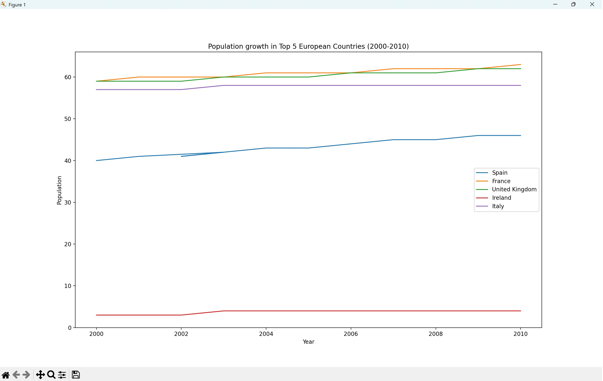

# European-and-African-Population-Analysis-Python-Project

## Population Analysis in Europe and Africa (Python Data Analysis)
## Project Overview

This project explores global population data using Python for data analysis and visualisation. The objective was to analyse population trends across regions, identify key patterns in population growth, and visualise insights using charts.

The analysis focuses on comparing population statistics across countries and regions, highlighting major population trends between 2000 and 2010.

This project was completed as part of a data analyst technical assessment, demonstrating practical skills in data cleaning, analysis, and visualisation.

## Tools & Technologies

Python

Pandas – data cleaning and analysis

NumPy – numerical operations

Matplotlib – data visualisation

Jupyter Notebook – analysis environment

## Dataset

The dataset contains population statistics for countries across multiple regions and years. The data was used to explore population distribution, growth patterns, and regional comparisons.

Key data fields include:

Country

Region

Population by year (2000–2010)

The dataset required basic cleaning and reshaping before analysis.

Analysis Tasks

The analysis addressed several key questions:

Data Quality Check

Identified countries with zero population recorded in 2000.

Regional Population Analysis

Calculated the total population of African countries in 2010.

Visualised population distribution across African countries.

Population Comparison

Calculated the average population of South American countries in 2000.

Identified countries with population above and below the regional average.

Large Population Countries

Identified countries with population exceeding 1 billion in 2007.

Visualised these countries using a chart.

Population Growth Analysis

Calculated population growth in Europe between 2000 and 2010.

Highlighted the top 5 countries with the largest population increase.

## Visualisations

The project includes several visualisations to communicate insights:

Population Distribution in Africa (2010)

Bar chart showing the population size of African countries, highlighting the variation in population distribution across the region.

Countries with Population Above 1 Billion (2007)

A bubble/dot chart highlighting countries with extremely large populations.

Population Growth in Europe (2000–2010)

Line chart illustrating population growth trends for the top five European countries with the largest population increase.

## Key Insights

Population distribution varies significantly across countries within the same region.

A small number of countries account for a large proportion of global population.

European population growth between 2000 and 2010 was concentrated in a few key countries.

Data visualisation helps highlight regional trends and large population differences.

## Skills Demonstrated

Data cleaning and preparation using Pandas

Data aggregation and filtering

Exploratory data analysis

Data visualisation using Matplotlib

Communicating insights through charts and summaries

## Conclusion

This project demonstrates the use of Python for exploratory data analysis, transforming raw population data into meaningful insights through statistical analysis and visualisation.
